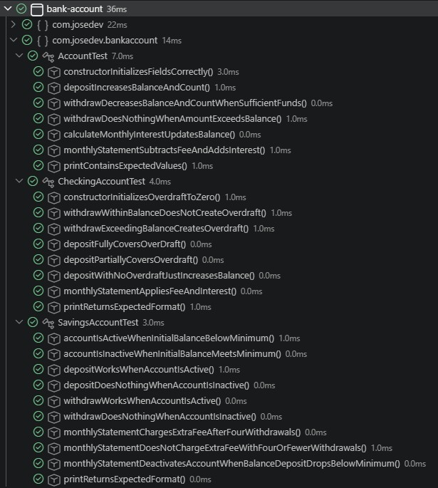
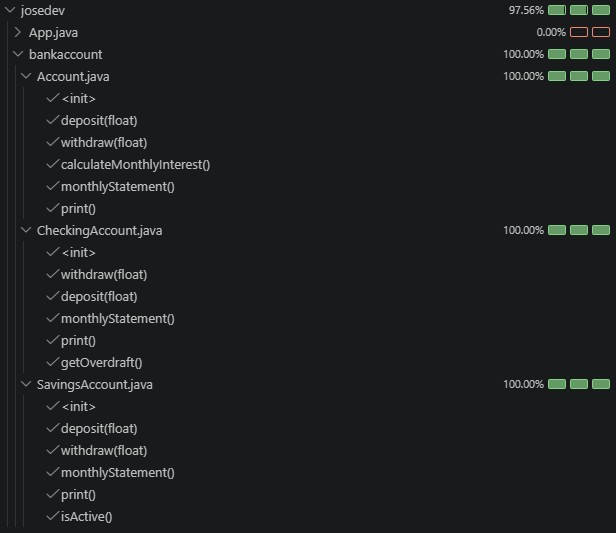
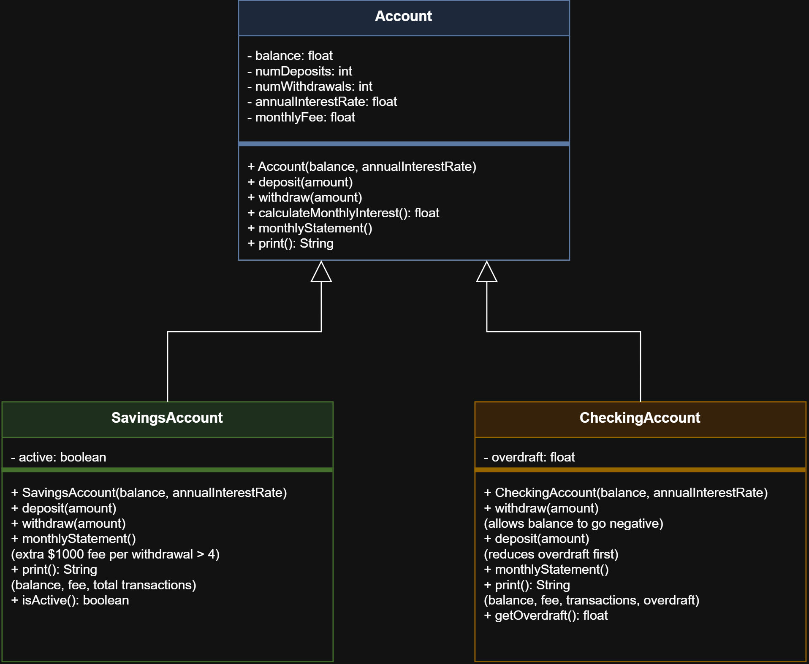

# Cuenta bancaria con JAVA

> Se requiere modelar el concepto de una cuenta bancaria con saldo, número de consignaciones, número de retiros, tasa anual y comisión mensual, junto con dos tipos de cuenta que heredan de ella: cuenta de ahorros y cuenta corriente, cada una con su propio comportamiento de negocio.

## Requisitos

- Modelar una cuenta bancaria
    - Saldo (tipo: `float`)
    - Número de consignaciones con valor inicial cero (tipo: `int`)
    - Número de retiros con valor inicial cero (tipo: `int`)
    - Tasa anual porcentual (tipo: `float`)
    - Comisión mensual con valor inicial cero (tipo: `float`)
- Clase cuenta
    - Constructor para inicializar atributos con valores pasados por parámetros
        - Saldo
        - Tasa anual
    - Métodos
        - Consignar una cantidad de dinero actualizando su saldo
        - Retirar una cantidad de dinero actualizando su saldo
            - El valor a retirar **no** debe superar el saldo
        - Calcular el interés mensaul de la cuenta actualizando el saldo correspondiente
        - Extracto mensual
            - Actualiza el saldo restándole la comisión mensual
            - Calcula el interés mensual correspondiente invocando al método anterior
        - Imprimir el retorno de los valores de los atributos
    - Clases hijas:
        - Cuenta de ahorro
            - Atributo para determinar si la cuenta está activa (tipo: `boolean`)
            - Saldo menor a $10000, la cuenta pasa a estar inactiva
            - Saldo mayor o igual a $10000, la cuenta pasa a estar activa
            - Métodos
                - Consignar dinero si la cuenta está activa invocando al método heredado
                - Retirar dinero si la cuenta está activa invocando al método heredado
                - Si el número de extractos mensuales supera el cero, por cada extracto se cobra $1000 como comisión
                    - Al generar un extracto determinamos si la cuenta está activa o no con el saldo
                - Nuevo método que imprima:
                    - Saldo de la cuenta
                    - Comisión mensual
                    - Número de transacciones realizadas (sumando consignaciones y retiros)
        - Cuenta corriente
            - Atributo de sobregiro (inicializa en cero)
            - Métodos:
                - Retirar dinero de la cuenta actualizando su saldo
                    - Se puede retirar más dinero que el saldo
                    - Este saldo que se debe se queda como sobregiro
                - Consignar invocando al método heredado
                    - En caso de sobreviro, la cantidad consignada reduce el sobregiro
                - Extracto mensual invocando al método heredado
                - Nuevo método que imprima:
                    - Saldo de la cuenta
                    - Comisión mensual
                    - Número de transacciones realizadas (sumando consignaciones y retiros)
                    - Valor de sobregiro

## Desarrollo

El proyecto se desarrolló en Java usando VS Code, con Maven como gestor de dependencias y build. Se partió de un archetype `maven-archetype-quickstart`, del cual se eliminaron plugins innecesarios para este ejercicio (checkstyle, enforcer) para evitar fallos de build ajenos al alcance del proyecto.

Se construyó primero la clase base `Account` con sus atributos protegidos y métodos (`deposit`, `withdraw`, `calculateMonthlyInterest`, `monthlyStatement`, `print`). A partir de ahí se derivaron `SavingsAccount` y `CheckingAccount`, cada una sobrescribiendo el comportamiento que el enunciado exigía como distinto (activación por saldo mínimo en una, manejo de sobregiro en la otra), reutilizando siempre que fue posible la lógica heredada mediante `super`.

## Tests

Para los tests, se creó un archivo de pruebas por cada clase (`AccountTest`, `SavingsAccountTest`, `CheckingAccountTest`), separando cada escenario de negocio en su propio método de test en lugar de agrupar todo en uno solo. Esto se hizo porque cada clase tiene comportamientos claramente distintos (activación de cuenta, sobregiro, comisiones por retiros extra) que se entienden mejor de forma individual:

| Clase | Escenarios cubiertos | 
| --- | --- |
| `Account` | Constructor, `deposit()`, `withdraw()` (con y sin fondos suficientes), `calculateMonthlyInterest()`, `monthlyStatement()`, `print()` |
| `SavingsAccount` | Activación/inactivación según saldo mínimo, `deposit()`/`withdraw()` bloqueados si está inactiva, comisión extra tras el 4º retiro, `print()` |
| `CheckingAccount` | Sobregiro al retirar más del saldo disponible, reducción total y parcial del sobregiro al consignar, `monthlyStatement()`, `print()` |

Durante el desarrollo se detectó un bug real en `CheckingAccount.deposit()`: al cubrir el sobregiro, el método sumaba el monto consignado dos veces (una vez por `super.deposit(amount)` y otra al descontar el sobregiro), inflando el saldo. Los tests permitieron detectar este error antes de la entrega, y se corrigió calculando primero el excedente (`remainder`) real que debía sumarse al saldo.

### Capturas de pantalla

| Tests | Tests con coverage del 70% |
| --- | --- |
|  |  |

## Diagrama de clase

Como último entregable se pidió una captura de pantalla o imagen del diagrama de clases estilo UML.

